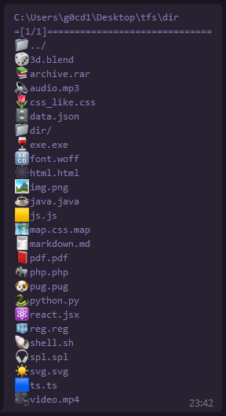
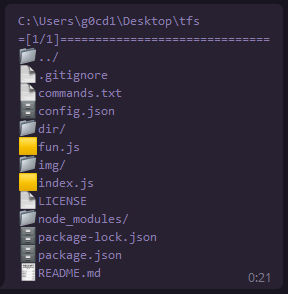

# Telegram File System

Access your file system from your Telegram

## Setup

1. Create new bot with [@BotFather](https://botfather.t.me)
2. Setup [config.json](./config.json) file
3. Setup next commands in [@BotFather](https://botfather.t.me) > /mybots > BOT_NAME > Edit Bot > Edit Commands
    ```
    pwd - present working directory
    root - show parent directory
    home - goto home directory
    ```

## Gallery



